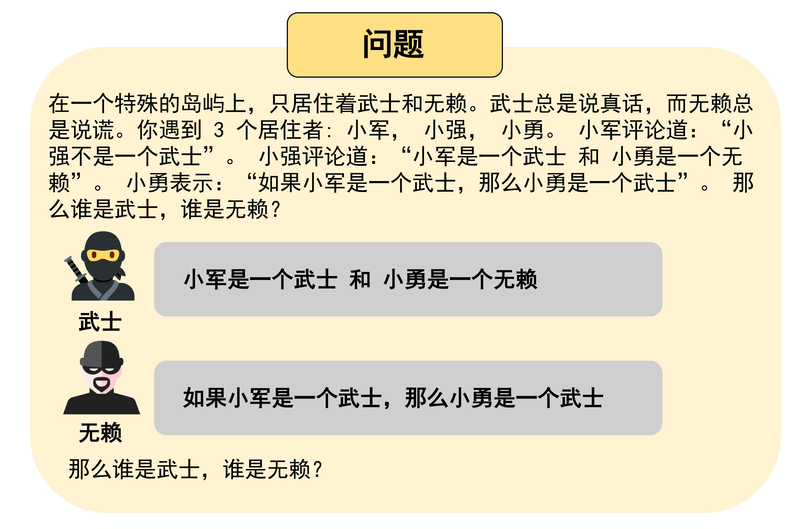
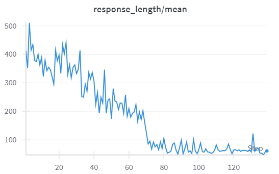
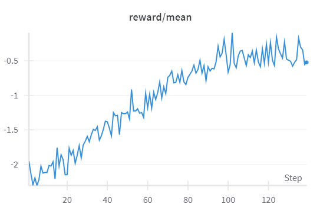

# Chinese-Logic-RL 🇨🇳


Chinese-Logic-RL: Exploring LLM Reasoning with Rule-based Reinforcement Learning in Chinese
---
As mentioned in many experiments, models trained on English corpora often switch to Chinese during the long reasoning process. This may be attributed to the high information compression capability of the Chinese language.

Hence, we aim to analyze how to evoke the **"aha moment" in Chinese logical reasoning** by transforming the **Knights and Knaves (K&K)** puzzles dataset into its Chinese counterpart, **"武士&无赖"**, where "武士" always tells the truth and "无赖" always lie.

<table>
  <tr>
    <td align="center">
      
    </td>
  </tr>
  <tr>
    <td align="center">Question Case</td>
  </tr>
</table>


## Installation

```bash
conda create -n logic-cn python=3.9
pip install torch==2.4.0 --index-url https://download.pytorch.org/whl/cu121
pip3 install vllm==0.6.3 ray
pip3 install flash-attn --no-build-isolation
pip install -e .  # For verl integration
pip install wandb IPython matplotlib
```

---

## Data Preparation

You can directly use /data.

The data is also available at [knights-and-knaves-ZH](https://huggingface.co/datasets/Trae1ounG/knights-and-knaves-ZH/tree/main), you can load as:
```
import datasets
datasets.load_dataset('Trae1ounG/knights-and-knaves-ZH', 'test')
```

For your own data generation, here's a quick bash script:

```
bash process_cn_data.sh
```

---

## Training Execution
```bash
conda activate logic-cn
bash main_run.sh  
```

---

## Modification Details

| Component              | Location                          |
|------------------------|-----------------------------------|
| Reward Modeling     | `verl/utils/reward_score/kk_cn.py`   |
| Data Preprocessing   | `examples/data_preprocess/kk_cn.py`  |
| Raw Data Generation | `mem-chinese-kk-logic/data_gen_kk.py` & `mem-chinese-kk-logic/lib_kk.py` |
---

## Results

Currently, I am only able to run Qwen2.5-1.5B on 4x3090 GPUs due to limitations in time and space. The results for response length and reward are presented below.

As the reward increases, the response length decreases significantly, leaving only a single sentence between `<think>` and `</think>`.

For example:
```
<think> reasoning process here </think>
<answer> (1) 小兰是武士
(2) 小慧是武士
(3) 小波是武士
(4) 小美是武士
(5) 小伟是武士
(6) 小梅是无赖 </answer>
```

We invite everyone to explore our project and delve into this intriguing question.

<table>
  <tr>
    <td align="center">
      
    </td>
     <td align="center">
      
    </td>
  </tr>
  
</table>


---

## Acknowledgements
- [Verl](https://github.com/volcengine/verl) 🔗
- [Logic-RL](https://github.com/Unakar/Logic-RL) 🔗
- [Knights and Knaves (K&K) puzzles dataset](https://github.com/AlphaPav/mem-kk-logic) 🔗

---

## Citation

```
@misc{Chinese-Logit-RL,
  title = {Chinese-Logic-RL: Exploring LLM Reasoning with Rule-based Reinforcement Learning in Chinese},
  author = {Yuqiao Tan},
  year = {2025},
  publisher = {GitHub},
  journal = {GitHub repository},
  howpublished = {\url{https://github.com/Trae1ounG/Chinese-Logic-RL}},
}
```

---
## Star History
If you found this repository intersting, please give us ⭐！

[](https://star-history.com/#Trae1ounG/Chinese-Logic-RL&Date)
